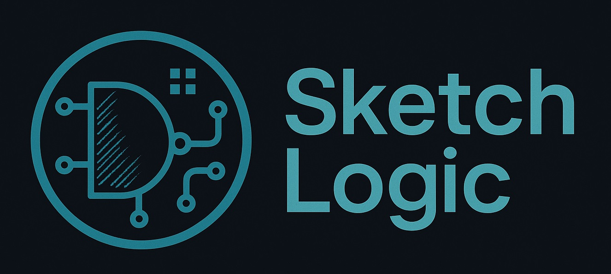

# Circuit Metadata Detector




SketchLogic is Circuit Metadata Detector that can detect logic gates, rotations, and wires from hand-drawn circuit sketches, export results as structured JSON and render a clean visualization.

**Project Status:** *Development phase.* 

---

## 📑 Table of Contents
1. [Tech Stack](#tech-stack)
1. [Key Features](#key-features)
1. [Components](#components)
2. [Repository Structure](#repository-structure)
3. [Installation & Usage](#installation-&-usage)
4. [Contributing](#contributing)
5. [License](#license)
6. [Contact](#contact)

---

## 🛠️ Tech Stack

### Frontend
- React (Vite)
- TypeScript
- Tailwind CSS
  
### Backend / API
- Flask
- Pillow (PIL) for image processing
- Custom CircuitParser

### Machine Learning / Computer Vision
- YOLOv8n (Ultralytics)
- PyTorch
- OpenCV
- scikit-image
- SciPy

### Data & Training
- Custom Dataset: published on kaggle
- Kaggle Notebook for Training

### Version Control
- Git
- GitHub

---

## 📋 Key Features
- Detect **logic gates** from sketches  
  *Supported:* AND, OR, NOT, NAND, NOR, XOR, XNOR
- Detect **gate rotation** (0°, 90°, 180°, 270°)
- Detect **wires** and return them as ordered XY polylines
- Export **all components with coordinates** in structured JSON
- Visualize the **reconstructed circuit**
- Accuracy: **>80% accuracy** on the above criteria

---

## 🔧 Components
- Custom YOLO model named **SKELO** used for gates detection
- Wire Detection Algorithms for detecting wires
- Frontend
- Backend API

---

## 📂 Repository Structure
```

SketchLogic
├─ backend/
│  └─ app.py
├─ frontend/
│  ├─ public/
│  │  ├─ logo.jpg
│  │  └─ vite.svg
│  ├─ src/
│  │  ├─ assets/
│  │  │  ├─ banner.jpg
│  │  │  └─ react.svg
│  │  ├─ api.ts
│  │  ├─ App.css
│  │  ├─ App.tsx
│  │  ├─ index.css
│  │  ├─ main.tsx
│  │  └─ vite-env.d.ts
│  ├─ eslint.config.js
│  ├─ index.html
│  ├─ package-lock.json
│  ├─ package.json
│  ├─ postcss.config.js
│  ├─ README.md
│  ├─ tailwind.config.js
│  ├─ tsconfig.app.json
│  ├─ tsconfig.json
│  ├─ tsconfig.node.json
│  └─ vite.config.ts
├─ skelo_ai/
│  ├─ __init__.py
│  ├─ circuit_parser.py
│  ├─ draw.py
│  ├─ inference.py
│  ├─ label.py
│  └─ wires.py
├─ CODE_OF_CONDUCT.md
├─ CONTRIBUTING.md
├─ example.jpg
├─ LICENSE
├─ pyproject.toml
├─ README.md
├─ requirements.txt
└─ SECURITY.md

````

---

## 📦 Installation & Usage

Clone the repository:

```bash
git clone https://github.com/ShahzaibAhmad05/SketchLogic.git
cd SketchLogic
````

Download the latest SKELO model from this [Google Drive Link](https://drive.google.com/drive/folders/1NRbsy8lcZ2MH3S7Gwx_btxaXnI0i2sdP?usp=sharing)

Unzip and place the model weights at:

```
SketchLogic
├─ skelo_ai/
│  └─ SKELOv*.pt
````

Install dependencies:

```bash
pip install -r requirements.txt
````

Launch backend locally (Flask api):

```bash
python backend/app.py
````

Move to frontend/ and run:

```bash
cd frontend
npm run dev
````

It will run at port 5173, paste http://localhost:5173/ in your browser and press Enter.

NOTE: This is currently under development. Installation is meant for development and testing only.

---

## 🤝 Contributing

- Early-stage project. Bug reports, suggestions, and small PRs are welcome anytime.

- If you would like to collaborate, please contact the owner using the information provided in the [Contact](#contact) section.

- For security issues, please use **private email** (see `SECURITY.md`).

---

## 📄 License

Distributed under the MIT License. See `LICENSE` for more information.


---

## ✉️ Contact

* **LinkedIn:** [ShahzaibAhmad05](https://www.linkedin.com/in/shahzaibahmad05)
* **Email:** [shahzaibahmad6789@gmail.com](mailto:shahzaibahmad6789@gmail.com)
