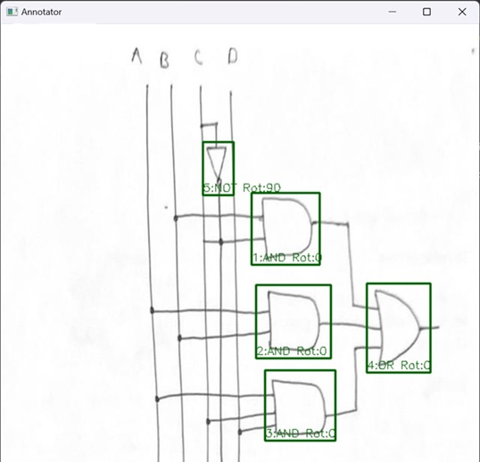

# ML-based Circuit Detector

**NOTE:** Currently in Initial Phase. The training script is error prone as of now. A stable release will be created along with the dataset soon.

Created in multiple modules, this project aims to:

- Detect Logic Gates from hand-drawn images  
  (Supported gates: AND, OR, NOT, NAND, NOR, XOR, XNOR)

- Detect Logic Gates' rotation from the same images  
  (Supported rotations: 0°, 90°, 180°, 270°)

- Detect Wires from the same images  
  (Output format: List of XY points)

- Acheive >95% Accuracy on the said Criteria

- Output all detected components and their coordinates in a clean JSON format

- Visualize the detected circuit as a computer-generated image

## Features & Usage:

- **Custom Annotation Tool**
  Associated File: "yolo_ai/dataset_annotator.py"

  Description: Used to annotate the raw dataset for this YOLO model. It can also 
              be used to observe how the Json files label the images.

  Dependencies: os, cv2, json

  Preview: 
  
  

---
