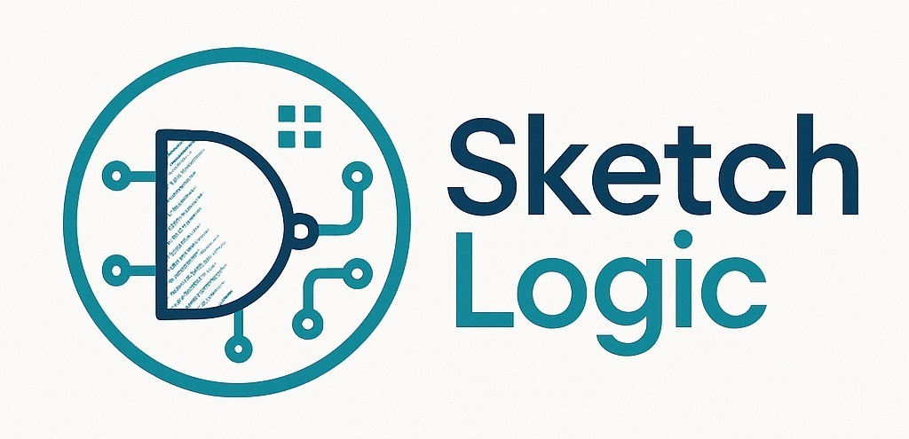

# ML-based Circuit Detector

> Detect logic gates, rotations, and wires from hand-drawn circuit sketches; export results as structured JSON and render a clean visualization.

**Project Status:** *Initial phase.* The training script is currently unstable. A first stable release and dataset will be published soon.

---

## 📌 Table of Contents
1. [Overview](#overview)
2. [Capabilities](#capabilities)
3. [Repository Structure](#repository-structure)
4. [Installation](#installation)
5. [Usage](#usage)
    - [Annotation Tool](#annotation-tool)
    - [Training (WIP)](#training-wip)
    - [Inference (WIP)](#inference-wip)
6. [Data & Output Format](#data--output-format)
7. [Contributing](#contributing)
8. [License](#license)
9. [Contact](#contact)

---

## Overview
This project aims to recognize circuit components from hand-drawn images and produce both a machine-readable representation and a rendered visualization.

---

## Capabilities
- Detect **logic gates** from sketches  
  *Supported:* AND, OR, NOT, NAND, NOR, XOR, XNOR
- Detect **gate rotation** (0°, 90°, 180°, 270°)
- Detect **wires** and return them as ordered XY polylines
- Export **all components with coordinates** in structured JSON
- Visualize the **reconstructed circuit**
- Target: **>95% accuracy** on the above criteria

---

## Repository Structure
```

SketchLogic
├─ assets/
│  ├─ social-preview\.jpg
│  └─ annotator-preview\.jpg
├─ yolo\_ai/
│  └─ dataset\_annotator.py     # Custom Annotation Tool
├─ 
└─ README.md

````

---

## Installation
```bash
# Clone repository
git clone https://github.com/ShahzaibAhmad05/SketchLogic.git
cd SketchLogic
````
Currently under development. Proper installation steps will be added before the first release.

---

## Usage

### Annotation Tool

Custom tool for labeling raw images and inspecting JSON label structure.

* **Script:** `yolo_ai/dataset_annotator.py`
* **Dependencies:** `os`, `cv2`, `json`
* **Run:**

```bash
python yolo_ai/dataset_annotator.py
```

---

### Training (WIP)

Training scripts are currently unstable. A stable training pipeline (with configs and dataset links) will be published in the first release.

---

### Inference (WIP)

A simple inference entry point (image → JSON + visualization) will be added alongside the stable release.

---

## Data & Output Format

**Wire format:** list of XY points per wire (polyline).
**Component format:** type, rotation, and bounding/anchor coordinates.
**PLEASE NOTE:** This format is subject to change.

**Example JSON (illustrative):**

```json
{
  "image": "sample_001.png",
  "components": [
    {"type": "AND",  "rotation": 90,  "bbox": [x1, y1, x2, y2]},
    {"type": "NOT",  "rotation": 0,   "bbox": [x1, y1, x2, y2]}
  ],
  "wires": [
    {"points": [[x, y], [x, y], [x, y]]},
    {"points": [[x, y], [x, y]]}
  ]
}
```

> Replace with your final schema once stabilized.

---

## Contributing

Early-stage project. Bug reports, suggestions, and small PRs are welcome once the first release lands.
For security issues, please use **private email** (see `SECURITY.md`).

---

## License

Distributed under the MIT License. See `LICENSE` for more information.

---

## Contact

* **LinkedIn:** [https://www.linkedin.com/in/shahzaibahmad05](https://www.linkedin.com/in/shahzaibahmad05)
* **Email:** [shahzaibahmad6789@gmail.com](mailto:shahzaibahmad6789@gmail.com)
